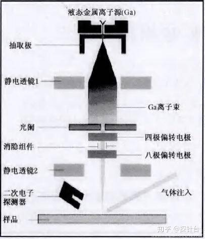
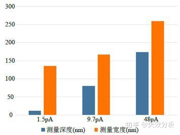

# FIB

## 离子源

镓元素低饱和蒸汽压，低熔点，不易被氧化。

---

## 影响因素

[影响因素介绍](https://zhuanlan.zhihu.com/p/76763208)

### 离子束强度

离子束强度越高，聚焦效果越好，离子速度越高。带来的是刻蚀速度的增加，束斑的减小。

### 束流分布

整体上束流呈现高斯分布。宽度由半高峰宽决定，并且结构边缘非垂直边缘；

电流越大，离子数量越多，高斯分布的半高峰宽宽度越小，适合精细结构。

TODO：确认这个矛盾

### 离子束电流

离子束电流越大，刻蚀宽度和深度都变大，宽度会变的慢一点。小电流适合刻蚀精细结构。

### 驻留时间

驻留时间大，再沉积效果大。

再沉积有一定的方向性。

