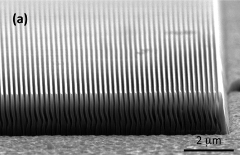

# Tapered Structure

This effect can be minimized by:

1. Increasing the applied power for ion energy (RF power);
2. Slightly reduced power (ICP power) for density control;

This adjustment will open up the slope wall by physical sputtering.

And for better slope wall:

1. Take the adjustment every 1.5 um during etching;

>Fabrication of diamond diffraction gratings for experiments with intense hard x-rays