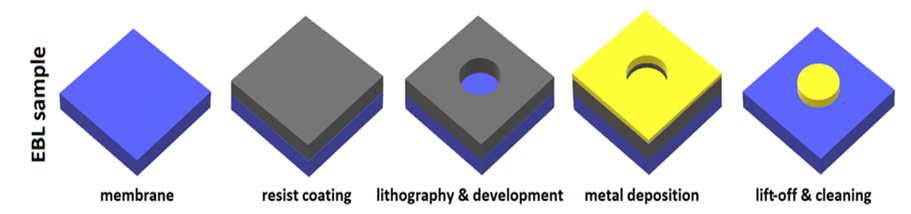

- [1. horak_comparative_2018](#1dot-horak_comparative_2018)
  - [1.1. Fabricate method](#1dot1-fabricate-method)
  - [1.2. Critical size control](#1dot2-critical-size-control)
  - [1.3. Parameters](#1dot3-parameters)

# Ebl Parameters <!-- omit in toc --> 

# 1. horak_comparative_2018

## 1.1. Fabricate method

## 1.2. Critical size control

| size   | Plan         | actual        | Comment |
| :----- | :----------- | :------------ | :------ |
| radius | 120 ~ 140 nm | $\pm 5$ nm    |         |
| height | 25 nm        | $26 \pm 6$ nm |         |

## 1.3. Parameters

| Process     | Content                                                      | Comment                        |
| :---------- | :----------------------------------------------------------- | :----------------------------- |
| Resist      | 70nm PMMA dissolved in ethyl acetate                         |                                |
| Exposure    | 30Kev, 100pA BC, 320 uC/cm2 dose                             |                                |
| Development | AR 600-56, 3min                                              | Stopper, isopropyl alcohol 30s |
| Lift-off    | 4h acetone with 1h supersonic; isopropyl-ethanol-water clean |                                |

