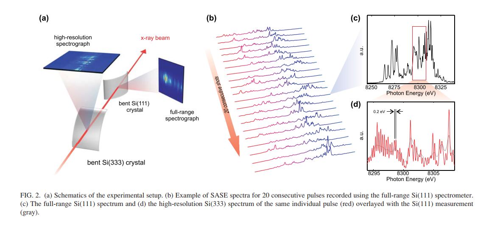

# Shot-to-shot fluctuations
> A single-shot transmissive spectrometer for hard x-ray free electron lasers

---

## **Background**
 Each single shot spectrum appears distinctly different from the others and consists of a large number of spikes with varying width and magnitude;

## **Necessity**
The wildly varying spectral signature of the SASE FEL pulses underscores the need for a single-shot diagnostic.