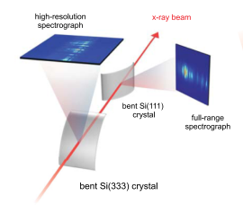

# Transmissive Spectrometer Design
>A single-shot transmissive spectrometer for hard x-ray free electron lasers

Bend the ultra-thin single crystal silicon as a splitter and spectrometer at the same time.

