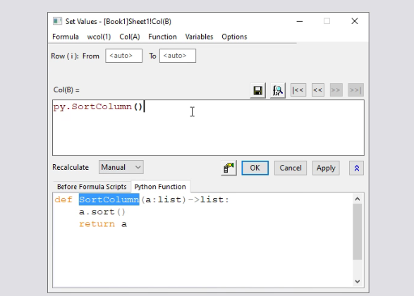

# Originlab Pro Lecture

## Initialize the layout 

`view` -> `toolbars` -> `customize` -> `initialize`;

## Plugins or APP

Installation: `App Center`;

### recommended apps 

`Stats advisor`: find proper statics models;

`Fitting function`: more function supplied for fitting;

`Color editor`: edit the color palette. Can extract color palette form articles published;

`Graph publisher`: step to step setting the formatting of the graph demanding by the publisher.

## F11 learning center

Gives a lot of examples exercise.

And the entrance of the Originlab blog website;

## F1 help center and start menu

like windows icon in the windows 10, the origin has the same functionality in the same place;

Click `F1` in any opened dialog tabs can open the online help center about this tab;

## user file

The place in where you can find you personal fitting function and picture themes. Moreover you can share those just copying the same file to the same place on other computer;

## Data connector

**Spider**: keep synchronization content of the website.

Attention: You can not change the content from the synchronization.

Excel in you computer also can do this.

The green status is the indicator of the synchronization.

And there are a lot of file type supported by origin the only thing you need do is `download now`;

## Merger graph

`graph` -> `merge graph windows`

`comment display`: the checked properties of all layers changed at the same time when you apply some adjustments on one layer;

`Scale element`:  TODO

### adjustment the margin

1. `graph` -> `fit layer to page`;

2. `edit` -> `export` -> `margin offset`

## Macros to plot the same type files

1. **templates**, right click the window bar of opened picture and saved as templates. They can be chosen in the `plot` tabs.

2. **themes**, and F7 button;

3. **copy all the formatting**;

4. **batch plotting**, `windows bar right click` -> `batch ploting`, choose the workbook/sheet/column you what to plot.

## Python 

### Python integrated in Origin

`connectivity` -> `new` -> `Python file`

Auto complete & debug & package control (like pycharm)

Need import Originpro package. TODO

### Script windows

like excel function applied on the column, you can use python script in the function.

### External python package

## resource

1. bilibili channel

2. Online chat (green button in the origin website)

3. Origin blog

